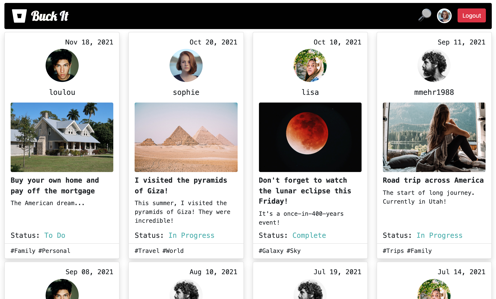
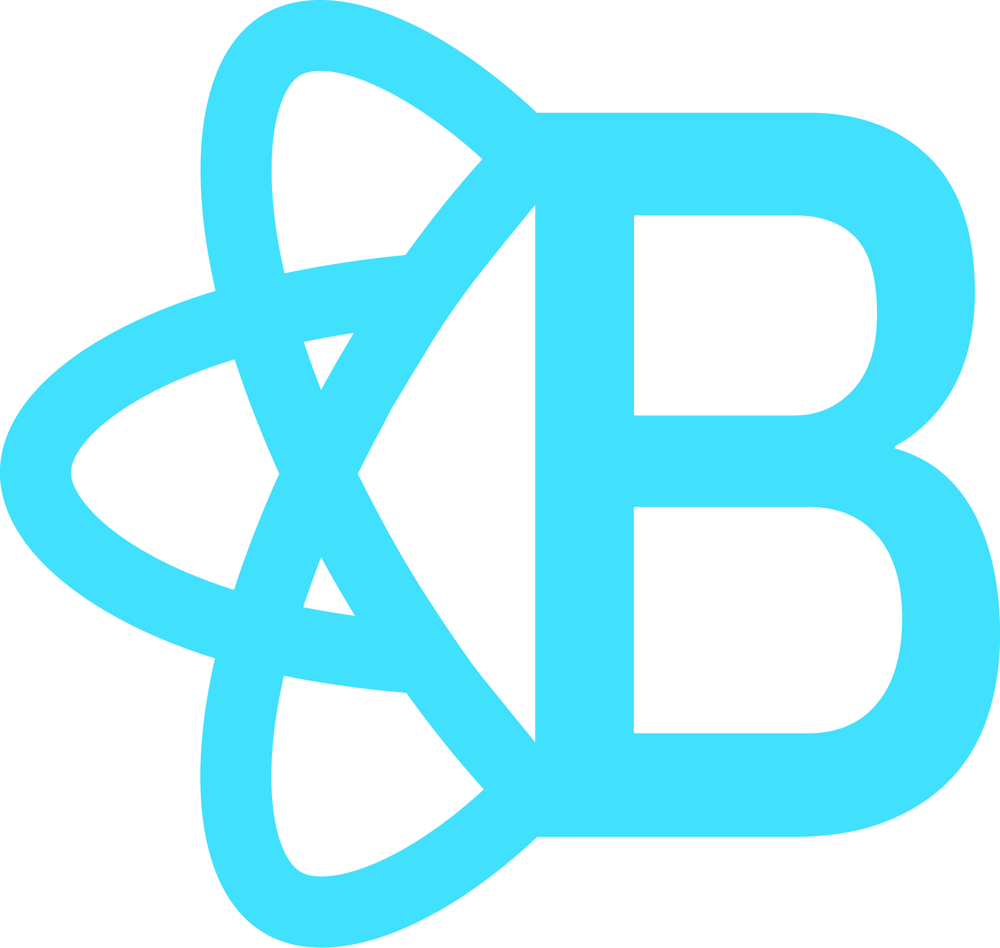

<a href="https://choosealicense.com/licenses/mit" target="_blank"></a>

# Buck-It

## Table of Contents:
1. [Link](#link)
1. [Description](#description)
1. [Preview](#preview)
1. [User Story](#user-story)
1. [Acceptance Criteria](#acceptance-criteria)
1. [Technologies](#technologies)

## Link
Link to site: https://buck-it-app.herokuapp.com/

## Description
<b>BuckIt</b> is a website that allows users to create, view, and share their bucket lists. It allows them to share their achievements and plans, and also at the same time be inspired by others.

## Preview
### Homepage


### Profile Page


## User Story
```
AN adventrurous human,
I WANT to create, record and share my BuckIt list with others
SO THAT we can live our lives to the fullest and remember to dream even when life gets challenging.
```

## Acceptance Criteria
```
GIVEN a bucket list inspired social media site
WHEN I visit the site for the first time
THEN I am presented with the homepage, which includes existing posts that include the username, user profile picture, post title, description, status, tags, and the date created from most recent at top
WHEN I look at the navigation bar
THEN I see the option to sign up or log in and a search bar
WHEN I choose to sign up
THEN I am prompted to enter an email, username, and password
WHEN I click on the sign-up button
THEN my user credentials are saved and I am logged into the site
WHEN I revisit the site at a later time and choose to log
THEN I am prompted to enter my username and password
WHEN I am signed in to the site
THEN I see navigation link for my profile, a search bar, and the option to log out
WHEN I click on my profile icon in the navigation
THEN I am taken to my profile and presented with my username, bio, profile picture, profile banner, any blog posts I have already created, and the option to edit my profile, add something new to my bucket list, add a new post, and view my followers and followings
WHEN I click on the button to edit profile
THEN I am prompted to change either my email, password, bio, profile picture, profile banner, and turn on privacy mode
WHEN I click on the button to add a new BuckIt list
THEN I am prompted to enter a title and the progress
WHEN I click on the button to create a new post
THEN I am prompted to enter a title, description, picture, two tags, and pick a BuckIt
WHEN I click on the following or followers buttons
THEN I can view my followers and followings
WHEN I click on the search icon in the navigation
THEN I am presented with a search bar to search any user by the username
WHEN I click on the logout option in the navigation
THEN I am signed out of the site
```

## Technologies
### Front End
&nbsp; &nbsp;
&nbsp; &nbsp; &nbsp; 
&nbsp; &nbsp; &nbsp; 


### Back End
&nbsp; &nbsp; &nbsp; 
&nbsp; &nbsp; &nbsp; 
&nbsp; &nbsp; &nbsp; 
&nbsp; &nbsp; &nbsp; 
&nbsp; &nbsp; &nbsp; 
&nbsp; &nbsp; &nbsp; 
